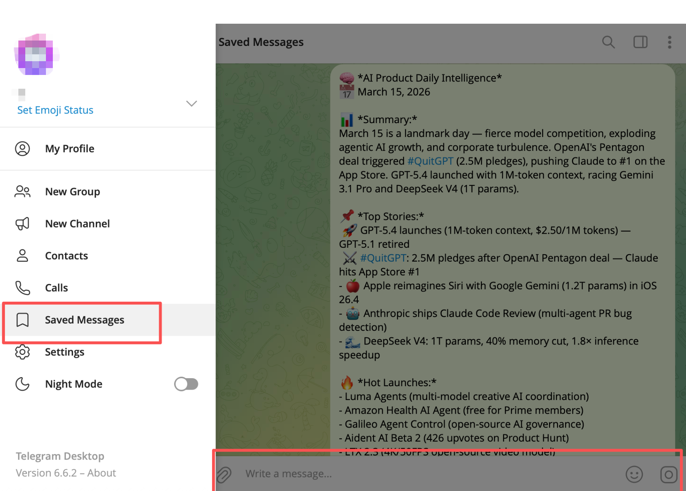
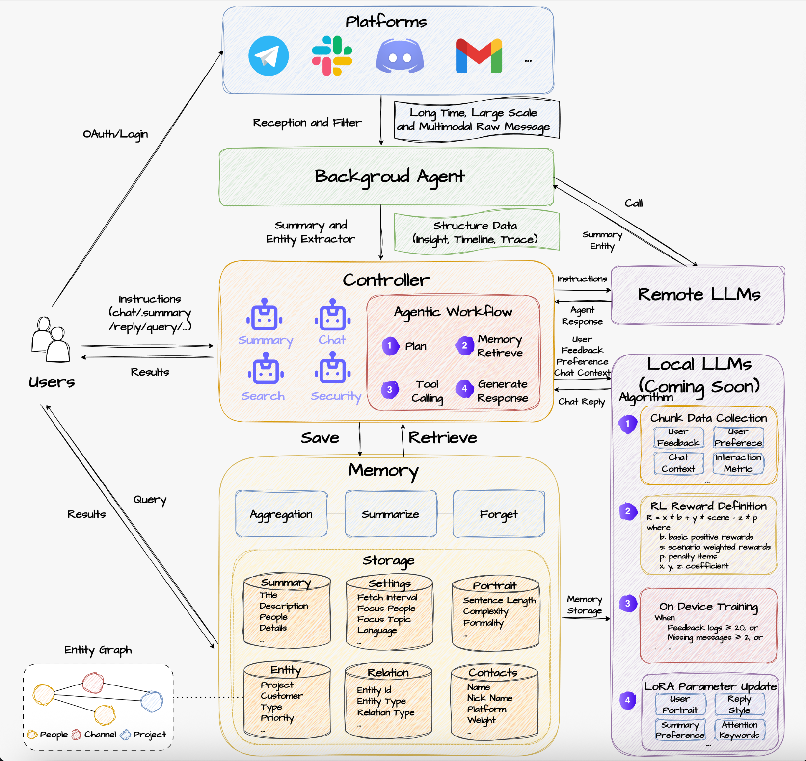

<div align="center">
<picture>
  <source media="(prefers-color-scheme: dark)" srcset="apps/web/public/images/logo-dark-light.svg">
  
</picture>

</br>
</br>

[](https://nodejs.org) [](https://tauri.app) [](https://alloomi.ai) [](https://www.apache.org/licenses/LICENSE-2.0) [](https://discord.com/invite/xkJaJyWcsv) [](https://x.com/AlloomiAI)

#### _Proactive AI workspace — understands your intent, orchestrates execution, and gets things done._

  <a href="https://github.com/melandlabs/release">
    
  </a>
</div>

Alloomi is a **proactive AI workspace** that monitors business signals, orchestrates tasks autonomously, and tracks and validates results end-to-end. Unlike traditional AI assistants that are passive workflow tools, Alloomi acts as a **proactive AI workspace** that watches, learns, remembers, and acts on your behalf.

> ⚠️ **Open-source vs Full Product**: This is the open-source core. For the full ready-to-use product, download from **[alloomi.ai](https://alloomi.ai)**

<p align="center">
<a href="#quick-start">Quick Start</a>&nbsp;|&nbsp;
<a href="#screenshots">Screenshots</a>&nbsp;|&nbsp;
<a href="#features">Features</a>&nbsp;|&nbsp;
<a href="#quick-questions">Q & A</a>&nbsp;|&nbsp;
<a href="https://alloomi.ai/docs">Documentation</a>&nbsp;|&nbsp;
<a href="https://alloomi.ai/blogs">Blogs</a>
</p>

## What Problems Does Alloomi Solve?

| Without Alloomi | With Alloomi |
|-----------------|--------------|
| Switching between WeChat, Telegram, WhatsApp to reply | **One interface, reply to all** |
| Manually check Slack, Email, Calendar for updates | **AI proactively alerts you** |
| Repetitive tasks done manually every day | **Set scheduled tasks, AI executes automatically** |
| Forget context after months | **Long-term memory that remembers everything** |

---

## Quick Start

### Option 1: Desktop Client (Recommended)

```bash
# Download desktop client (macOS / Windows / Linux)
# Visit: https://github.com/melandlabs/release
# Or: https://alloomi.ai
```

### Option 2: Run from Source

```bash
# 1. Clone the repo
git clone https://github.com/melandlabs/alloomi
cd alloomi

# 2. Copy environment config
cp apps/web/.env.example apps/web/.env

# 3. Generate keys
openssl rand -base64 32  # AUTH_SECRET
node -e "console.log(require('crypto').randomBytes(32).toString('base64url'))"  # ENCRYPTION_KEY

# 4. Configure AI API
ANTHROPIC_BASE_URL=https://api.anthropic.com
ANTHROPIC_API_KEY=sk-ant-...
ANTHROPIC_MODEL=claude-sonnet-4-6

LLM_BASE_URL=https://api.openai.com/v1
LLM_API_KEY=sk-...
LLM_MODEL=gpt-4o

# 5. Start
pnpm install
pnpm tauri:dev
```

> ⚠️ **Open Source vs Full Version**
> - **Open Source**: Core modules + bring your own API keys + configure MCPs
> - **Full Version**: [alloomi.ai](https://alloomi.ai) — download and use immediately


## Screenshots

- Document Previews — Docx, PPTx, Xlsx & Mind Map

<table align="center">
<tr>
<td></td>
<td></td>
</tr>
<tr>
<td></td>
<td></td>
</tr>
</table>

- Website Generation


- Mutliple Connectors


- Automation & Cron Jobs


- Library


- Skills


- Message Apps



## Features

### Core Capabilities

- **📡 Proactive Awareness** — monitors signals across Slack, Email, Calendar, Documents and alerts you proactively before issues escalate
- **🧠 Long-Term Memory (Context Atlas)** — persistent knowledge graphs of people, projects, and decisions; remembers context even months later
- **🎯 95% Noise Filtering** — hundreds of daily messages refined into one focused panel; tells you what you should act on
- **⚡ Autonomous Execution** — drafts replies, schedules meetings, generates reports, tracks and validates results end-to-end; supports **scheduled tasks** (cron-like recurring jobs) and **proactively triggered tasks** (event-driven actions based on signals from Slack, Email, Calendar, etc.)
- **💬 Natural Chat** — assign tasks in plain language; no complex commands to learn with powerful skills and MCP tools

### Built-in File Preview

- **Documents** — Docx, DOC, ODT, RTF
- **Spreadsheets** — Xlsx, XLS, CSV, ODS
- **Presentations** — PPTx, PPT, ODP
- **PDF** — PDF files with full rendering
- **Images** — JPG, PNG, GIF, SVG, WebP, BMP
- **Code** — Syntax-highlighted preview for JS, TS, Python, Go, Rust, and 20+ languages and HTML preview with live rendering

### Multi-Platform Access

- **Messaging Apps** — Telegram, WhatsApp, iMessage, QQ, Feishu, Weixin, Dingtalk integrations with message fetching, sending, file attachments, and real-time sync
- **Desktop Apps** — Native apps for Windows, macOS, and Linux with keyboard shortcuts and system tray

### Enterprise-Grade Security

- AES-256 end-to-end encryption
- Hardware-isolated processing environments (no public gateways)
- Zero training commitments — your data never trains public AI models
- Local-first architecture

### Agent Runtime Integrations

- **Claude Code** — Anthropic's coding agent (auto-inherits `ANTHROPIC_API_KEY`, `ANTHROPIC_BASE_URL`, `ANTHROPIC_MODEL` from environment & [skills](https://code.claude.com/docs/en/skills) in `~/.claude/skills`) _(Default)_
- **Codex** — OpenAI's code generation agent _(Coming Soon)_
- **Gemmi** — General-purpose AI agent _(Coming Soon)_
- **Pi** — Inflection AI's personal agent _(Coming Soon)_
- **OpenClaw** — Open agent protocol & ecosystem _(Coming Soon)_
- **Hermes Agent** — NousResearch's agent framework _(Coming Soon)_

### Hybrid Model Architecture (Coming Soon)

- **🤖 Hybrid Model Routing** — dynamically routes tasks to optimal models (Claude, GPT, Gemini, open-source) based on complexity, cost, and latency requirements
- **🧪 Reinforcement Learning from Feedback (RLHF) & LoRA** — continuously improves task execution quality through human feedback signals
- **🔄 Multi-Agent Debate** — multiple specialized agents collaborate and debate to reach higher-quality decisions
- **📊 Outcome Validation** — end-to-end result verification with automated checks and human-in-the-loop approval workflows
- **🧬 Adaptive Personalization** — learns your communication style, preferences, and workflows over time

## Documentation

Detailed documentation is available at [Alloomi Website](https://alloomi.ai/docs).

## Quick Questions

<details>
<summary><b>What Makes Alloomi Different?</b></summary>

Most AI assistants are **workflow tools**—you give commands, they execute tasks, with no knowledge of
who you are. Sometimes they surprise you in ways you didn't expect. But usually, most of the time, they
frustrate you, filled with uncertainty, and accompanied by issues of context, memory, cost, and security.

Alloomi is different: it's a **proactive digital partner** that watches, learns, remembers, and acts on
your behalf. The difference is architectural.

When you connect your messaging platforms and integrations to Alloomi, you don't just chat with it through
Telegram, WhatsApp, and other apps—you also sync everything with your permission: raw messages, meetings,
emails, tweets, calendar events, voice calls, and any notes or ideas you've captured. All of this—including
your conversations with Alloomi itself—becomes the **single source of truth** for Alloomi's brain.

Behind the scenes, Alloomi runs a background agent on a continuous sync loop, actively gathering information
from all your connected sources. An agent without this loop can only respond based on stale context. With it,
every conversation—and every moment—makes Alloomi smarter and more aligned with you. When you create a custom
agent role in Alloomi to handle one-off or scheduled tasks, this brain acts as the orchestrator, dramatically
improving execution quality.



Alloomi implements a complete **"Receive → Process → Remember → Understand → Serve"** loop:

| Layer             | What It Does                                                                                         |
| ----------------- | ---------------------------------------------------------------------------------------------------- |
| **📡 Receive**    | Multi-platform, multi-modal ingestion — IM, email, documents, files, web data, voice calls           |
| **⚙️ Process**    | Noise reduction at scale — deduplication, OCR, ASR, intent extraction, semantic clustering           |
| **🧠 Remember**   | Persistent knowledge graph — people, projects, decisions — survives conversations and months of time |
| **🎯 Understand** | Deep semantic intent, cross-modal understanding, emotional tone, contextual relevance                |
| **🚀 Serve**      | Proactive delivery — smart summaries, auto-replies, scheduled reports, personalized alerts           |

### Layered Memory Architecture

- **Raw information** — original messages, files, transcripts
- **Information insights** — extracted entities, decisions, key events, timeline, execution diff
- **Contextual memory** — recent conversation state, temporary context
- **Knowledge-base memory** — long-term people/projects/preferences knowledge graph

</details>

<details>
<summary><b>Is it free?</b></summary>

Yes! Alloomi is **completely free and open source**. You can use any AI API keys you prefer. If you prefer a hosted, fully-managed experience without setup, you can also choose the commercial version at [alloomi.ai](https://alloomi.ai).

</details>

<details>
<summary><b>Is my data secure?</b></summary>

Yes! All data is stored on your machine.

</details>
